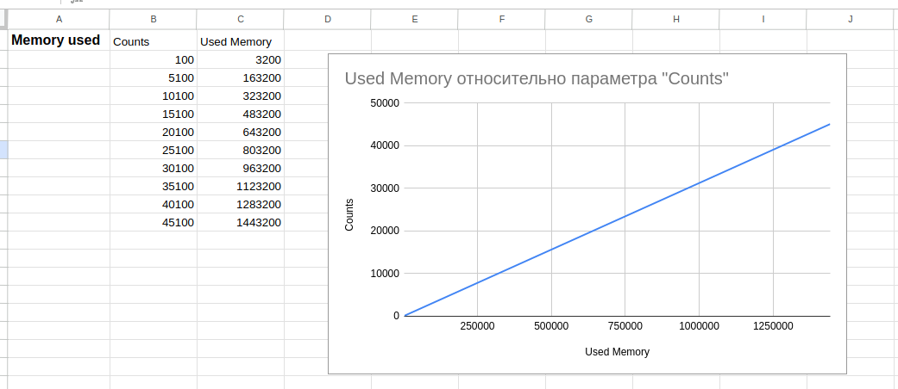
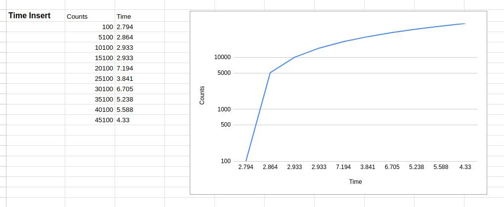
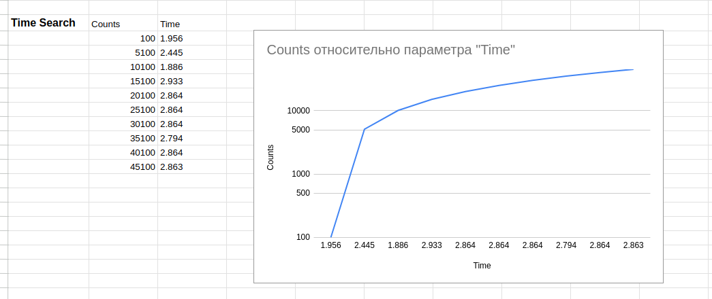
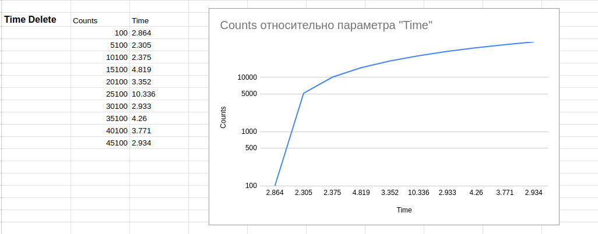

# data-structures-algoritms
Test balanced binary search tree, counting sort algoritm with random datasets

* For testing need to, look on `Time taken` and `Memory used`
- run a `docker-compose up`
- go to `http://localhost:90`
- and show result in `/logs/balanced-binary.txt`

